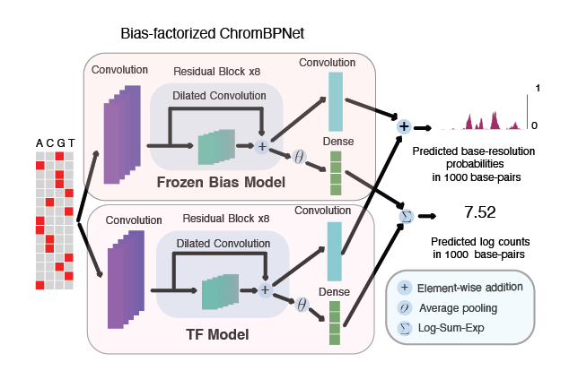

# Bias factorized, base-resolution deep learning models of chromatin accessibility reveal cis-regulatory sequence syntax, transcription factor footprints and regulatory variants

- This repo contains code for the paper `Bias factorized, base-resolution deep learning models of chromatin accessibility reveal cis-regulatory sequence syntax, transcription factor footprints and regulatory variants` (technical report coming soon) by  Anusri Pampari*, Anna Shcherbina*, Anshul Kundaje. (*authors contributed equally)  
- Please contact [Anusri Pampari] (\<first-name\>@stanford.edu) for suggestions and comments. 
- Here is a link to the [slides](https://docs.google.com/presentation/d/1Ow6K8TYN40u7T3ODdo-JRCLuv5fUUacA/edit?usp=sharing&ouid=104820480456877027097&rtpof=true&sd=true), [ISMB talk](https://www.youtube.com/watch?v=3W3JeJvvjLc) and a comprehensive [tutorial](https://github.com/kundajelab/chrombpnet/wiki). Please see the [FAQ](https://github.com/kundajelab/chrombpnet/wiki/FAQ) and file a github [issue](https://github.com/kundajelab/chrombpnet/issues) if you have questions.
- If you are using chrombpnet <= v0.1.3 please refer to the note here - https://github.com/kundajelab/chrombpnet/wiki/Denovo-motif-discovery 
- If you are using chrombpnet repo actively in your project, I strongly recommend adding yourself to the watchers list for updates. Click on the eye symbol (below the star and above the fork symbol to the right). This will keep you informed of all the major updates and bugs posted for this repo.  

Chromatin profiles (DNASE-seq and ATAC-seq) exhibit multi-resolution shapes and spans regulated by co-operative binding of transcription factors (TFs). This complexity is further difficult to mine because of confounding bias from enzymes (DNASE-I/Tn5) used in these assays. Existing methods do not account for this complexity at base-resolution and do not account for enzyme bias correctly, thus missing the high-resolution architecture of these profiles. Here we introduce ChromBPNet to address both these aspects.

ChromBPNet (shown in the image as `Bias-Factorized ChromBPNet`) is a fully convolutional neural network that uses dilated convolutions with residual connections to enable large receptive fields with efficient parameterization. It also performs automatic assay bias correction in two steps, first by learning simple model on chromatin background that captures the enzyme effect (called `Frozen Bias Model` in the image). Then we use this model to regress out the effect of the enzyme from the ATAC-seq/DNASE-seq profiles. This two step process ensures that the sequence component of the ChromBPNet model (called `TF Model`) does not learn enzymatic bias. 

<p align="center">

</p>

## Table of contents

- [Installation](#installation)
- [QuickStart](#quickstart)
- [How-to-cite](#how-to-cite)

## Installation

This section will discuss the packages needed to train a ChromBPNet model. Firstly, it is recommended that you use a GPU for model training and have the necessary NVIDIA drivers and CUDA already installed. You can verify that your machine is set up to use GPU's properly by executing the `nvidia-smi` command and ensuring that the command returns information about your system GPU(s) (rather than an error). Secondly there are two ways to ensure you have the necessary packages to train ChromBPNet models which we detail below,

### 1. Running in docker 

Download and install the latest version of Docker for your platform. Here is the link for the installers -<a href="https://docs.docker.com/get-docker/">Docker Installers</a>.  Run the docker run command below to open an environment with all the packages installed and do `cd chrombpnet` to start running the tutorial.

> **Note:**
> To access your system GPU's from within the docker container, you must have [NVIDIA Container Toolkit](https://docs.nvidia.com/datacenter/cloud-native/container-toolkit/install-guide.html) installed on your host machine.

```
docker run -it --rm --memory=100g --gpus device=0  kundajelab/chrombpnet:latest
```

### 2. Local installation

Create a clean conda environment with python >=3.8 
```
conda create -n chrombpnet python=3.8
conda activate chrombpnet
```

Install non-Python  requirements via conda
```
conda install -y -c conda-forge -c bioconda samtools bedtools ucsc-bedgraphtobigwig pybigwig meme
```
#### Install from pypi 

```
pip install chrombpnet
```
#### Install from source
```
git clone https://github.com/kundajelab/chrombpnet.git
pip install -e chrombpnet
```

## QuickStart

### Bias-factorized ChromBPNet training

The command to train ChromBPNet with pre-trained bias model will look like this:

```
chrombpnet pipeline \
  -ibam /path/to/input.bam \ # only one of ibam, ifrag or itag is accepted
  -ifrag /path/to/input.tsv \ # only one of ibam, ifrag or itag is accepted
  -itag /path/to/input.tagAlign \ # only one of ibam, ifrag or itag is accepted
  -d "ATAC" \
  -g /path/to/hg38.fa \
  -c /path/to/hg38.chrom.sizes \ 
  -p /path/to/peaks.bed \
  -n /path/to/nonpeaks.bed \
  -fl /path/to/fold_0.json \
  -b /path/to/bias.h5 \ 
  -o path/to/output/dir/ \
```

#### Input Format

- `-ibam` or `-ifrag` or `-itag`: input file path with filtered reads in one of bam, fragment or tagalign formats. Example files for supported types - [bam](https://mitra.stanford.edu/kundaje/oak/anusri/chrombpnet_data/input_files/ENCSR868FGK_merged.bam), [fragment](https://mitra.stanford.edu/kundaje/oak/anusri/chrombpnet_data/input_files/example.fragments.tsv), [tagalign](https://mitra.stanford.edu/kundaje/oak/anusri/chrombpnet_data/input_files/example.tagAlign) 
- `-d`: assay type. The following types are supported - "ATAC" or "DNASE"
- `-g`: reference genome fasta file. Example file human reference - [hg38.fa](https://mitra.stanford.edu/kundaje/oak/anusri/chrombpnet_data/input_files/hg38.genome.fa)
- `-c`: chromosome and size tab separated file. Example file in human reference - [hg38.chrom.sizes](https://mitra.stanford.edu/kundaje/oak/anusri/chrombpnet_data/input_files/hg38.chrom.sizes)
- `-p`: Input peaks in narrowPeak file format, and must have 10 columns, with values minimally for chr, start, end and summit (10th column). Every region 	  is centered at start + summit internally, across all regions. Example file with [ENCSR868FGK](https://www.encodeproject.org/experiments/ENCSR868FGK/) dataset - [peaks.bed](https://mitra.stanford.edu/kundaje/oak/anusri/chrombpnet_data/input_files/ENCSR868FGK_relaxed_peaks_no_blacklist.bed)
- `-n`: Input nonpeaks (background regions)in narrowPeak file format, and must have 10 columns, with values minimally for chr, start, end and summit 	  	(10th column). Every region is centered at start + summit internally, across all regions. Example file with [ENCSR868FGK](https://www.encodeproject.org/experiments/ENCSR868FGK/) dataset - [nonpeaks.bed](https://mitra.stanford.edu/kundaje/oak/anusri/chrombpnet_data/input_files/ENCSR868FGK_nonpeaks_no_blacklist.bed). More instructions on how to make your own nonpeak file can be found in the [Preprocessing](https://github.com/kundajelab/chrombpnet/wiki/Preprocessing#generate-non-peaks-background-regions) guide.
- `-fl`: json file showing split of chromosomes for train, test and valid. Example 5 fold jsons for human reference -  [folds](https://mitra.stanford.edu/kundaje/oak/anusri/chrombpnet_data/input_files/folds/) 
- `-b`: Bias model in `.h5` format. Bias models are generally transferable across  assay types following similar protocol. Repository of pre-trained bias models for use [here](https://mitra.stanford.edu/kundaje/oak/anusri/chrombpnet_data/input_files/bias_models/). Instructions to train custom bias model below.
- `-o`: Output directory path

Please find scripts and best practices for preprocssing [here](https://github.com/kundajelab/chrombpnet/wiki/Preprocessing).

#### Output Format

The ouput directory will be populated as follows -

```
models\
	bias_model_scaled.h5
	chrombpnet.h5
	chrombpnet_nobias.h5 (TF-Model i.e model to predict bias corrected accessibility profile) 
logs\
	chrombpnet.log (loss per epoch)
	chrombpnet.log.batch (loss per batch per epoch)
	(..other hyperparameters used in training)
	
auxilary\
	filtered.peaks
	filtered.nonpeaks
	...

evaluation\
	overall_report.pdf
	overall_report.html
	bw_shift_qc.png 
	bias_metrics.json 
	chrombpnet_metrics.json
	chrombpnet_only_peaks.counts_pearsonr.png
	chrombpnet_only_peaks.profile_jsd.png
	chrombpnet_nobias_profile_motifs.pdf
	chrombpnet_nobias_counts_motifs.pdf
	chrombpnet_nobias_max_bias_response.txt
	chrombpnet_nobias.....footprint.png
	...
```
Detailed usage guide with more information on input arguments and the output file formats and how to work with them are provided [here](https://github.com/kundajelab/chrombpnet/wiki/ChromBPNet-training) and [here](https://github.com/kundajelab/chrombpnet/wiki/Output-format).

For more information, also see:

- [Full documentation list](https://github.com/kundajelab/chrombpnet/wiki)
- [Detailed list of input arguments](https://github.com/kundajelab/chrombpnet/wiki/ChromBPNet-training)
- [Detailed usage guide with more information on the output file formats and how to work with them](https://github.com/kundajelab/chrombpnet/wiki/Output-format)
- [Best practices for preprocessing](https://github.com/kundajelab/chrombpnet/wiki/Preprocessing)
- [Training tutorial](https://github.com/kundajelab/chrombpnet/wiki/Tutorial)
- [Frequently Asked Questions, FAQ](https://github.com/kundajelab/chrombpnet/wiki/FAQ)
 
## Bias Model training

The command to train a custom bias bias model will look like this:

```
chrombpnet bias pipeline \
  -ibam /path/to/input.bam \ # only one of ibam, ifrag or itag is accepted
  -ifrag /path/to/input.tsv \ # only one of ibam, ifrag or itag is accepted
  -itag /path/to/input.tagAlign \ # only one of ibam, ifrag or itag is accepted
  -d "ATAC" \
  -g /path/to/hg38.fa \
  -c /path/to/hg38.chrom.sizes \ 
  -p /path/to/peaks.bed \
  -n /path/to/nonpeaks.bed \
  -fl /path/to/fold_0.json \
  -b 0.5 \ 
  -o path/to/output/dir/ \
```

#### Input Format

- `-ibam` or `-ifrag` or `-itag`: input file path with filtered reads in one of bam, fragment or tagalign formats. Example files for supported types - [bam](https://mitra.stanford.edu/kundaje/oak/anusri/chrombpnet_data/input_files/ENCSR868FGK_merged.bam), [fragment](https://mitra.stanford.edu/kundaje/oak/anusri/chrombpnet_data/input_files/example.fragments.tsv), [tagalign](https://mitra.stanford.edu/kundaje/oak/anusri/chrombpnet_data/input_files/example.tagAlign) 
- `-d`: assay type.  Following types are supported - "ATAC" or "DNASE"
- `-g`: reference genome fasta file. Example file human reference - [hg38.fa](https://mitra.stanford.edu/kundaje/oak/anusri/chrombpnet_data/input_files/hg38.genome.fa)
- `-c`: chromosome and size tab separated file. Example file in human reference - [hg38.chrom.sizes](https://mitra.stanford.edu/kundaje/oak/anusri/chrombpnet_data/input_files/hg38.chrom.sizes)
- `-p`: Input peaks in narrowPeak file format, and must have 10 columns, with values minimally for chr, start, end and summit (10th column). Every region 	  is centered at start + summit internally, across all regions. Example file with [ENCSR868FGK](https://www.encodeproject.org/experiments/ENCSR868FGK/) dataset - [peaks.bed](https://mitra.stanford.edu/kundaje/oak/anusri/chrombpnet_data/input_files/ENCSR868FGK_relaxed_peaks_no_blacklist.bed)
- `-n`: Input nonpeaks (background regions)in narrowPeak file format, and must have 10 columns, with values minimally for chr, start, end and summit 	  	(10th column). Every region is centered at start + summit internally, across all regions. Example file with [ENCSR868FGK](https://www.encodeproject.org/experiments/ENCSR868FGK/) dataset - [nonpeaks.bed](https://mitra.stanford.edu/kundaje/oak/anusri/chrombpnet_data/input_files/ENCSR868FGK_nonpeaks_no_blacklist.bed)
- `-f`: json file showing split of chromosomes for train, test and valid. Example 5 fold jsons for human reference -  [folds](https://mitra.stanford.edu/kundaje/oak/anusri/chrombpnet_data/input_files/folds/) 
- `-o`: Output directory path

Please find scripts and best practices for preprocessing [here](https://github.com/kundajelab/chrombpnet/wiki/Preprocessing).

#### Output Format

The output directory will be populated as follows -


```
models\
	bias.h5
logs\
	bias.log (loss per epoch)
	bias.log.batch (loss per batch per epoch)
	(..other hyperparameters used in training)
	
intermediates\
	...

evaluation\
        overall_report.html
        overall_report.pdf
	pwm_from_input.png
        k562_epoch_loss.png 
	bias_metrics.json
	bias_only_peaks.counts_pearsonr.png
	bias_only_peaks.profile_jsd.png
	bias_only_nonpeaks.counts_pearsonr.png
	bias_only_nonpeaks.profile_jsd.png
        bias_predictions.h5
	bias_profile.pdf
	bias_counts.pdf
	...
```
Detailed usage guide with more information on the input arguments and output file formats and how to work with them are provided [here](https://github.com/kundajelab/chrombpnet/wiki/Bias-model-training) and [here](https://github.com/kundajelab/chrombpnet/wiki/Output-format).

For more information, also see:

- [Full documentation list](https://github.com/kundajelab/chrombpnet/wiki)
- [Detailed list of input arguments](https://github.com/kundajelab/chrombpnet/wiki/Bias-model-training)
- [Detailed usage guide with more information on the output file formats and how to work with them](https://github.com/kundajelab/chrombpnet/wiki/Output-format)
- [Best practices for preprocessing](https://github.com/kundajelab/chrombpnet/wiki/Preprocessing)
- [Training tutorial](https://github.com/kundajelab/chrombpnet/wiki/Tutorial)
- [Frequently Asked Questions, FAQ](https://github.com/kundajelab/chrombpnet/wiki/FAQ)
 
## How to Cite

If github citations are not allowed in your submissions please reach out to Anusri Pampari and Anshul Kundaje. 
If you're using ChromBPNet in your work, please cite as follows:


```
@software{Pampari_Bias_factorized_base-resolution_2023,
author = {Pampari, Anusri and Shcherbina, Anna and Nair, Surag and Schreiber, Jacob and Patel, Aman and Wang, Austin and Kundu, Soumya and Shrikumar, Avanti and Kundaje, Anshul},
doi = {10.5281/zenodo.7567627},
month = {1},
title = {{Bias factorized, base-resolution deep learning models of chromatin accessibility reveal cis-regulatory sequence syntax, transcription factor footprints and regulatory variants.}},
url = {https://github.com/kundajelab/chrombpnet},
version = {0.1.1},
year = {2023}
}
```

