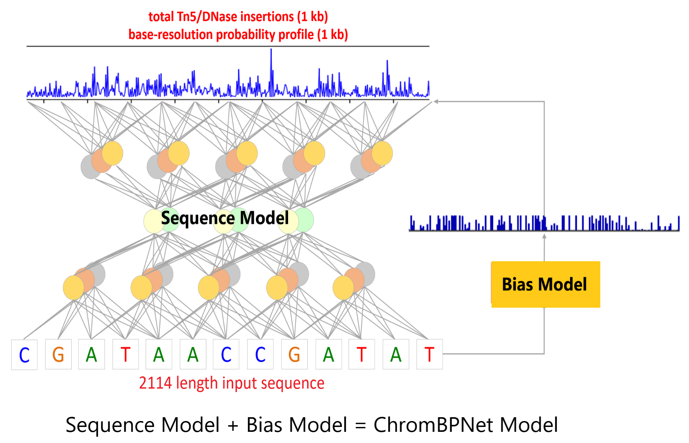

# ChromBPNet: Deep learning models of base-resolution chromatin profiles
                This repo is under construction. Incomplete documentation has been flagged as TODO section.

- This repo contains code for the chrombpnet paper Anusri Pampari*, Anna Shcherbina*, Anshul Kundaje. (*authors contributed equally to the work)  
- General queries/thoughts have been addressed in the discussion section below.
- Please contact [Anusri Pampari] (\<first-name\>@stanford.edu)  for suggestions and comments. More instructions about reporting bugs detailed below.
- Authors would like to thank Avanti Shrikumar and Surag Nair for their help with the project.

## Quick Links

- [About](#chrombpnet)
- [Installation](#installation)
- [Tutorial](#tutorial-on-how-to-train-chrombpnet-models)
    - [Preprocessing](#preprocessing)
    - [Train and Evaluate Bias Model](#train-and-evaluate-bias-model)
    - [Train and Evaluate ChromBPNet Model](#train-and-evaluate-chrombpnet-model)

##  ChromBPNet

Chromatin profiles (DNASE-seq and ATAC-seq) exhibit multi-resolution shapes and spans regulated by co-operative binding of transcription factors (TFs). This complexity is further difficult to mine because of confounding bias from enzymes (DNASE-I/Tn5) used in these assays. Existing methods do not account for this complexity at base-resolution and do not account for enzyme bias correctly, thus missing the high-resolution architecture of these profile. Here we introduce ChromBPNet to address both these aspects.

ChromBPNet (shown in the image as `chrombpnet model`) is a fully convolutional neural network that uses dilated convolutions with residual connections to enable large receptive fields with efficient parameterization. It also performs automatic assay bias correction in two steps, first by learning simple model on chromatin background that captures the enzyme effect (called `bias model` in the image). Then we use this model to regress out the effect of the enzyme from the ATAC-seq/DNASE-seq profiles. This two step process ensures that the sequence component of the ChromBPNet model (called `sequence model`) does not learn enzymatic bias. 



If you are interested in learning more about the detailed architectures used, please refer to the following architecture files - 

- bias model: https://github.com/kundajelab/chrombpnet/blob/master/src/training/models/bpnet_model.py
- chrombpnet model: https://github.com/kundajelab/chrombpnet/blob/master/src/training/models/chrombpnet_with_bias_model.py.

## Installation

This section will discuss the packages needed to train a chrombpnet model. Firstly, it is recommended that you use a GPU for model training and have the necessary NVIDIA drivers already installed. Secondly there are two ways to ensure you have the necessary packages to train chrombpnet models which we detail below,

### 1. Installation setup through Docker

Download and install the latest version of Docker for your platform. Here is the link for the installers -<a href="https://docs.docker.com/get-docker/">Docker Installers</a>.  Run the docker run command below to open a environment with all the packages installed and do `cd chrombpnet` to start running the tutorial.

```
docker run -it --rm --memory=100g --gpus device=0  kundajelab/chrombpnet:dev
```

### 2. Installation setup through Conda

Download and install the latest version of Miniconda for your platform. Here is the link for the installers - <a href="https://docs.conda.io/en/latest/miniconda.html">Miniconda Installers</a>. Using Conda you can setup your own environment from scratch by following the commands in https://github.com/kundajelab/chrombpnet/blob/master/dockerfile.

First create a new virtual environment and activate it as shown below

```
conda create --name chrombpnet python=3.7.9
conda activate chrombpnet
```

Now install the packages required by chrombpnet as follows.

```
conda install -y -c bioconda samtools bedtools ucsc-bedgraphtobigwig 
pip install git+https://github.com/kundajelab/chrombpnet.git
```
	
##  Tutorial on how to train chrombpnet models

Here we provide a step-by-step guide to training and evaluating chrombpnet models using the K562 bulk ATAC-seq data <a href="https://www.encodeproject.org/experiments/ENCSR868FGK">(ENCSR868FGK)</a>. Here we assume that all the scripts are being run from the main `chrombpnet` directory.

###  Preprocessing

#### Step 1: Download experimental data

We will start by creating a directory (`data/downloads`) to download the bams and peaks files for ENCSR868FGK ENCODE dataset using the commands in the bash script below. 

```
mkdir data
mkdir data/downloads
bash step1_download_bams_and_peaks.sh data/downloads
```

Following are some things to keep in mind when using custom datasets/downloads -
- For bulk ATAC-seq/DNASE-seq datasets we use the latest <a href="https://github.com/ENCODE-DCC/atac-seq-pipeline ">ENCODE ATAC-seq protocol</a>  for peak-calling. 
- If you are downloading the data from the ENCODE portal you can download the peaks flagged default for ATAC-seq datasets. For DNASE-seq datasets you might have to use MACS2 and follow the ENCODE ATAC-seq protocol for peak-calling.  (TODO - provide scripts to call peaks on filtered bams).
- For paired end data we download the filtered bams and for single-end data we download the unfiltered bams from the pipeline/ENCODE portal. Please refer to the documentation below to understand the reason for this difference `src/helpers/preprocessing/`
- TODO - add notes on how this will be different for scATAC.

#### Step 2: Make Bigwigs from Bam files (IMPORTANT STEP! PLEASE READ CAREFULLY)

We will now create unstranded bigwigs (i.e. the + and - strand ends are combined into one stranded bigwig) from the bam files (downloaded in step1) using the command below. This workflow uses the following two commands (1) `src/helpers/preprocessing/bam_to_bigwig.sh`: Considers that the given bam files are *unshifted* and does a shift of +4/-4 and (2) `src/helpers/preprocessing/analysis/build_pwm_from_bigwig.py` generates an image of the bias motif obtained from the shifted bams. 

```
bash step2_make_bigwigs_from_bams.sh data/downloads/merged.bam data/downloads/K562 ATAC_PE data/downloads/hg38.fa hg38.chrom.sizes
```

This command will generate two important output files - `data/downloads/K562_unstranded.bw`(unstranded bigwig file) and `data/downloads/K562_bias_pwm.png` (bias motif image). Open the `data/downloads/K562_bias_pwm.png` image generated by the script and you will see the following Tn5 motif PWM for this dataset.


Following are some things to keep in mind when using custom datasets/downloads -

- **IMPORTANT NOTE 1:** If you are running these commands on custom experimental bam files - *read the documentation* in the directory `src/helpers/preprocessing/` and  `src/helpers/preprocessing/analysis/` to make sure you are using this worflow correctly. Always use the scripts in `src/helpers/preprocessing/analysis/` to make sure that you see Tn5 or DNASE-I bias PWM in the output image generated. If you do not see the bias motif it is likely that the bam's that you provided have a shift of some kind. Please provide only unshifted bams to the script. **Do not proceed further if you do not see a Tn5 or DNASE-I motif after this step.** 

- **IMPORTANT NOTE 2:** If you are running the pipeline on custom generated bigwigs (without using `src/helpers/preprocessing/`) make sure the bigwigs are unstranded and the shifts are done correctly. To check this run the scripts in `src/helpers/preprocessing/analysis/` and make sure that you see the Tn5 or DNASE-I bias PWM in the output image generated. **Do not proceed further if you do not see a Tn5 or DNASE-I motif after this step.** 

- TODO - add preprocessing scripts for scATAC datasets.

##### Define train, validation and test chromosome splits

For chrombpnet model training we split the dataset by chromosomes for training, validation and testing. Run the commands below to generate  the  `json` formatted files containing the splits. The script is programmed to generate five json files each with a different fold (split) information. You can choose any fold for model training. For the purpose of this tutorial we will use `data/splits/fold_0.json`

```
mkdir data/splits
python src/helpers/make_chr_splits/splits.py -o data/splits/
```

If you want to mention custom splits please edit the `splits.py` file directly and make sure that the output json formatting is consistent with the current formatting in `splits.py` (the formatting is important for all the scripts being used in this tutorial).

#### Step 3: Generate background regions (non-peaks) gc-matched with the peaks

Here we will generate non-peak background regions that GC-match with the peak regions. We will use the non-peaks regions to train and evaluate a bias model. We will also use these regions in chrombpnet model training and as background regions to get marginal footprints. There are two key steps to this process - 

Firstly, we will start by dividing the entire genome into overlapping bins of `inputlen` regions. ChromBpnet models are trained on `inputlen` of 2114, so we will divide the entire genome into non-overlapping bins of length of 2114 input length and calculate their gc-fraction value. 


For convenience the genome wide buckets we created on human genome (hg38) reference can be downloaded as follows -  

```
wget http://mitra.stanford.edu/kundaje/anusri/chrombpnet_downloads/genomewide_gc_hg38_stride_50_inputlen_2114.bed -O data/downloads/genomewide_gc_hg38_stride_50_inputlen_2114.bed
```
To generate this file directly from the scripts run the command below - 

```
python src/helpers/make_gc_matched_negatives/get_genomewide_gc_buckets/get_genomewide_gc_bins.py -g data/downloads/hg38.fa -c data/downloads/hg38.chrom.sizes -o data/downloads/genomewide_gc_hg38_stride_50_inputlen_2114.bed -il 2114 --s 50
```
NOTE: The script above can take several hours to complete, but it is a one-time run for every reference genome. Please contribute if you know of ways to speed this step.

Secondly, we will filter the regions from the genome-wide buckets created from the above step such that they do not fall in peak regions or blacklist regions but have similar GC-distribution as the peaks.

```
mkdir data/negatives_data
bash step3_get_background_regions.sh data/downloads/hg38.fa data/downloads/hg38.chrom.sizes data/downloads/blacklist.bed.gz data/downloads/overlap.bed.gz 2114 data/downloads/genomewide_gc_hg38_stride_50_inputlen_2114.bed data/negatives_data data/splits/fold_0.json
```

Following are some things to keep in mind when using custom datasets 

- `data/negatives_data/negatives_with_summit.bed` is the non-peaks file we will be using for further analysis below.
- To understand all the outputs generated by these scripts refer to the documentation at `src/helpers/make_gc_matched_negatives`. 
- The scripts  `src/helpers/make_gc_matched_negatives` filter out peaks for which  `inputlen` (here 2114) region cannot be constructed (this can happen if the summit/center of the peak is on the edge). For custom datasets if the reference genome is very small, than using `inputlen` of 2114 can filter out a lot of peaks - in which case users are encouraged to use smaller `inputlen`.

###  Train and Evaluate Bias Model

We are now ready to train a bias model! 

#### Step 4: Train Bias Model

We will train a bias model on the non-peak regions by running the `step4_train_bias_model.sh` command as shown below 

```
mkdir models
mkdir models/bias_model
bash step4_train_bias_model.sh data/hg38.fa data/downloads/K562_unstranded.bw data/downloads/overlap.bed.gz data/negatives_data/negatives_with_summit.bed data/splits/fold_0.json 0.5 models/bias_model

```

The script `step4_train_bias_model.sh` runs the following three steps -  
 1. Generate hyperparmeters file for bias model: In this step we will filter non-peaks regions for training and also find some important training hyperparameters. As a part of the filtration step we will filter out (b) non-peak regions that are on the edges of the chromosome (b) non-peak regions which are outliers in total counts and (c) regions of length 2114 which have total counts greater than a threshold (given by `min(total counts in peaks)*bias_threshold_factor`). The `min(total counts in peaks)` is the minimum of the total counts in peak regions of length 2114 and the `bias_threshold_factor` is default set to `0.5` and can be adjusted by the user. This threshold ensures that the bias model training is done only in sufficiently low-count regions so that the bias model captures only the effect of the bias motif and not the effect of cell-type specific motifs.
 2. Train the bias model using the hyper-parameters and filtered regions in train/valid chromosomes mentioned in `data/splits/fold_0.json`. This step will output a bias model  `models/bias_model/bias.h5` in h5py format.
 3. Get predictions on the non-peak regions in test chromosomes in `data/splits/fold_0.json` and report the metrics in `models/bias_model/bias_metrics.json` and the predictions in `models/bias_model/bias_predictions.h5`

Following are some things to keep in mind when using custom datasets -

- **IMPORTANT NOTE 1:** Notes on setting the value of `bias_threshold_factor` parameter -
    - If `bias_threshold_factor` is set to very low value you might filter out a lot of non-peak regions and the bias model might be sub-optimal (this will be reflected in the final performance metrics output by the model - poor jsd performance might imply a sub-optimal bias model). 
    - If `bias_threshold_factor` is set to very high you might include non-peak regions with high counts and this might lead to the bias model capturing cell-type specific motifs  (which is not ideal as we want to regress out only the bias motifs effect and not cell-type specific motifs effect). We will do Step 5 of the tutorial to make sure that the bias model captures only bias motifs. If the output in Step 5 shows cell-type specific motifs in addition to the bias motifs you have to repeat bias model training with a lower `bias_threshold_factor`.

#### Step 5: Interpret bias model

In this step we will try to summarize the motifs captured by the bias model by first getting contribution scores (using <a href="https://github.com/kundajelab/shap">DeepSHAP</a>) of the bias model in peak regions and then summarizing the contribution scores as PWMs (using  <a href="https://github.com/kundajelab/tfmodisco">TF-MoDISCO</a>) to identify motifs. For the bias model we expect to find PWMs of only the bias enzyme (Tn5/DNASE-I). If we see any other cell-type specific motifs apart form the bias enzymes me will need to re-do Step 4 with reduced `bias_threshold_factor`.

NOTE: It is computationally expensive to run this step on all the peaks -  since we are looking for a quick sanity check for our bias models we will subsample 30K peaks from our original peak set for interpretation. Additionally we will also make sure that this peak set does not overlap with the blacklist regions as follows.

```
inputlen=2114
blacklist_region=data/downloads/blacklist.bed.gz
chrom_sizes=data/downloads/hg38.chrom.sizes
overlap_peak=data/downloads/overlap.bed.gz

mkdir data/subsample_peaks

flank_size=$(( inputlen/2 ))
bedtools slop -i $blacklist_region -g $chrom_sizes -b $flank_size > data/subsample_peaks/temp.txt
bedtools intersect -v -a $overlap_peak -b data/subsample_peaks/temp.txt | shuf  > data/subsample_peaks/temp_n.txt
shuf -n 30000 data/subsample_peaks/temp_n.txt > data/subsample_peaks/30K.subsample.overlap.bed
rm  data/subsample_peaks/temp.txt
rm data/subsample_peaks/temp_n.txt
```

Once we have the subsampled peak set we will run the script below to first get interpretation scores (as h5 files `models/bias_model/interpret/bias.profile_scores.h5` and `models/bias_model/interpret/bias.counts_scores.h5`) and then summarize the interpretation scores into PWMs (as png images in `models/bias_model/interpret/untrimmed_logos_counts` and `models/bias_model/interpret/untrimmed_logos_profile`). Browse through the images (with prefix name `contrib_`) in both the PWM folders and make sure you only see the bias motif (Tn5/DNASE-I) or repeats and not any other cell-type specific motifs.

```
mkdir models/bias_model/interpret
bash step5_interpret_bias_model.sh data/downloads/hg38.fa data/subsample_peaks/30K.subsample.overlap.bed models/bias_model/bias.h5 models/bias_model/interpret/
```

###  Train and Evaluate ChromBPNet Model

Now that we have a bias model we will use it to regress out the bias enzymes effect from the ATAC-seq and DNASE-seq signal and fetch the sequence component of the model that captures only the cell-type specific behavior. 

#### Step 6: Train ChromBPNet Model (This step will also generate the sequence model)

We will use the bias model trained in Step 4 to regress out the effect of the bias enzyme by running the command below

```
mkdir models/chrombpnet_model
bash step6_train_chrombpnet_model.sh data/downloads/hg38.fa data/downloads/K data/downloads/overlap.bed.gz data/downloads/negatives_with_summit.bed data/splits/fold_0.json models/bias_model/bias.h5 models/chrombpnet_model ATAC_PE

```

The script `step4_train_bias_model.sh` runs the following five steps -  
 1. Generate hyperparmeters file for chrombpnet model: In this step we will filter peak and non-peaks regions for training and also find some important training hyperparameters. As a part of the filtration step we will filter out (a) peaks and non-peaks regions that are on the edges of the chromosome and (b) peaks and non-peaks which are outliers in total counts.
 2. Train the chrombpnet model using the hyper-parameters and filtered regions in train/valid chromosomes mentioned in `data/splits/fold_0.json`. This step will output a scaled bias model `models/chrombpnet_model/bias_model_scaled.h5` , chrombpnet model  `models/chrombpnet_model/chrombpnet.h5` and sequence model `models/chrombpnet_model/chrombpnet_wo_bias.h5` in h5py format. 
 3. Get predictions on the peak and non-peak regions in test chromosomes in `data/splits/fold_0.json` and report the metrics in `models/chrombpnet_model/bias_metrics.json`, `models/chrombpnet_model/chrombpnet_metrics.json` and `models/chrombpnet_model/chrombpnet_wo_bias_metrics.json`. The script also stores the predictions in `.h5` format.
 4. Get marginal footprints for the `models/chrombpnet_model/chrombpnet.h5` on the bias motif (Tn5 or DNASE-I). You will find the footprint images and scores in `models/chrombpnet_model/footprints/` directory with `uncorrected` prefix.
 5. Get marginal footprints for the `models/chrombpnet_model/chrombpnet_wo_bias.h5` on the bias motif (Tn5 or DNASE-I).  You will find the footprint images and scores in `models/chrombpnet_model/footprints/` directory with `corrected` prefix.

NOTE: The `models/chrombpnet_model/bias_model_scaled.h5` is the bias model  in use for bias correction - this is different from the input bias model by a scaling factor on the counts head. The user can choose to use a single bias model across different datasets (we empirically observed that bias models can be transferred across datasets) - in which case the script accounts for the difference in read-depths of the current dataset and the bias model training dataset by scaling the bias models counts head.

Following are some things to keep in mind when using custom datasets:
- Note that the script `step6_train_chrombpnet_model.sh` inputs an argument `data_type` (8th argument). The user can input the following four values for this argument - `ATAC_PE, DNASE_SE, DNASE_PE, ATAC_SE`. To understand the meaning of these arguments refer to `src/helpers/preprocessing/`.
- If `models/chrombpnet_model/footprints/corrected_footprints_score.txt` has values greater than 0.003, the chrombpnet models are not fully corrected for the bias. This is possible if the bias model is used incorrectly (if the bias model is transferred it is likely that the transfer has failed).


#### Step 7: Interpret the sequence model

We will now interpret the sequence model (`models/chrombpnet_model/chrombpnet_wo_bias.h5`) on the same subset of peak regions we used for interpreting the bias model. Here we would like to see only cell-type specific motifs in our output PWMs (no Tn5 or DNASE-I bias motifs).

NOTE: It is computationally expensive to run this step on all the peaks -  since we are looking for a quick bias-correction sanity check for our sequence models we will use a subsampled peak set. The users are encouraged to eventually run this step on all the peak regions for motif discovery.

```
mkdir models/chrombpnet_model/interpret
bash step7_interpret_chrombpnet_model.sh  data/downloads/hg38.fa data/subsample_peaks/30K.subsample.overlap.bed models/chrombpnet_model/chrombpnet_wo_bias.h5 models/chrombpnet_model/interpret/
```

The script outputs interpretation scores (as h5 files `models/chrombpnet_model/interpret/corrected.profile_scores.h5` and `models/chrombpnet_model/interpret/corrected.counts_scores.h5`) and then summarizes the interpretation scores into PWMs (as png images in `models/chrombpnet_model/interpret/untrimmed_logos_counts` and `models/chrombpnet_model/interpret/untrimmed_logos_profile`). Browse through the images (with prefix name `contrib_`) in both the PWM folders and make sure you only see cell-type specific motifs (here GATA, SP1) and not bias motifs (Tn5/DNASE-I). 

NOTE: The presence of bias motifs Tn5/DNase-I in the PWMs indicates that the chrombpnet models are not fully corrected for the bias.  This is possible if the bias model is used incorrectly (if the bias model is transferred it is likely that the transfer has failed).
